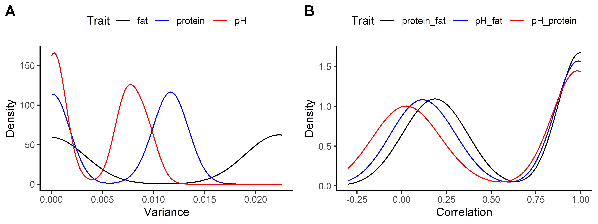

```{r}
knitr::opts_chunk$set(echo = TRUE)
options(scipen = 999)  # Prevent scientific notation on axes

```

# Overview
This document loads data, processes it, and generates three figures:

1. Figure 1: 1 Density plots of Mendelian sampling variances and trait correlations.

2. Figure 2: Similarity matrices and Euclidean clustering of the matrices for the aggregate genotype of milk traits.

3. Figure 3: Benchmark plots comparing computation time and memory usage.


# 1. Density Plots
### Import Packages 
We load required libraries 

```{r, message=F, warning=F}
library(ggplot2)     # For creating plots
library(reshape2)    # For reshaping data
library(corrplot)    # For correlation plots
require(RColorBrewer) # For color palettes
library(pheatmap)    # For heatmaps
library(ggpubr)      # For arranging ggplot figures
library(plyr)        # For data manipulation
library(reticulate)  # For interfacing with Python

```


### Import Data from PyMSQ
```{r}
source_python("debug.py")
data <- py$load_package_data()
gmap <- data[["chromosome_data"]]        # genetic map
meff <- data[["marker_effect_data"]]     # marker effects 
gmat <- data[["genotype_data"]]          # phased genotype 
group <- data[["group_data"]]            # group data 
ped <- data[["pedigree_data"]] 

# define number of traits and index weight
no_traits <- ncol(meff) # 3 traits
index_wt <- c(1, 1, 1)
```

### Compute Mendelian (co-)variance and correlation using PyMSQ
```{r, message=F, warning=F, results='hide'}
# Derive population covariance matrix for each chromosome
exp_ldmat <- expldmat(gmap = gmap, group = group, mposunit = "cM")
# Compute Mendelian (co-)variance
msvmsc <- msvarcov(gmat, gmap, meff, exp_ldmat = exp_ldmat, group = group, 
                   indwt = index_wt, progress = TRUE)
# Compute Mendelian correlation
mscorr <- msvarcov_corr(msvmsc) 
```
### Prepare and Plot the Density Data
We extract, melt, and plot the data.

```{r, message=F, warning=F, results='hide'}
# Extract relevant columns
msv_traits <- data.frame(msvmsc[, c("fat", "protein", "pH")])
mscorr_traits <- data.frame(mscorr[, c("protein_fat", "pH_fat", "pH_protein")])

# Reshape data
df_msv <- melt(msv_traits)
colnames(df_msv) <- c("Trait", "Variance")
df_mscorr <- melt(mscorr_traits)
colnames(df_mscorr) <- c("Trait", "Correlation")

# Create density plots
plot1 <- ggplot(df_msv, aes(Variance, color = Trait)) +
  stat_density(geom = "line", position = "identity") +
  theme_classic() +
  theme(legend.position = "top") +
  scale_color_manual(values = c("black", "blue", "red")) +
  ylab("Density")

plot2 <- ggplot(df_mscorr, aes(Correlation, color = Trait)) +
  stat_density(geom = "line", position = "identity") +
  theme_classic() +
  theme(legend.position = "top") +
  scale_color_manual(values = c("black", "blue", "red")) +
  ylab("Density") +
  scale_x_continuous(limits = c(-0.3, 1), breaks = seq(-0.25, 1, by = 0.25))
```

### Save and Display Figure 1
We combine the density plots and save them as a TIFF file. Then we include the saved image in the document.
```{r}
png("Figure1.png", width = 8, height = 3, units = 'in', res = 700)
ggarrange(plot1, plot2, labels = c("A", "B"), ncol = 2, nrow = 1)
dev.off()

```
Below is the final Figure 1:


# 2. Similarity Matrices
We then derive and cluster the similarity matrices.
```{r, message=F, warning=F, results='hide'}
# Derive similarity matrix
sim <- simmat(gmat, gmap, meff, group = group, exp_ldmat = exp_ldmat, 
              indwt = index_wt, progress = TRUE)[[1]]
# Standardize the similarity matrix
std_sim <- cov2cor(sim)
# Alternatively use the following to obtain standardized similarity matrix
# std_sim = simmat(gmat, gmap, meff, group = group, exp_ldmat = exp_ldmat, 
#     indwt = index_wt, stdsim = TRUE, progress = TRUE)[[1]]
```

### Within-family clustering of similarities
```{r}
# Renaming matrix rows and columns
row.names(sim) <- colnames(sim) <- 1:nrow(sim)          
row.names(std_sim) <- colnames(std_sim) <- 1:nrow(std_sim) 

# Initial setup for clustering based on family
pedigree <- data[["pedigree_data"]][-1, ] 
ped <- as.data.frame(pedigree[,2])

# determine number of individuals within a family
no <- NULL
for (i in 1:length(unique(ped[, 1]))) {
  first <- length(which(ped[, 1] == i))
  if (i == 1) {
    no <- c(no, first)
  } else {
    no <- c(no, first+no[i-1])
  }
}

# Clustering individuals within each family
ind <- NULL
for (i in 1:length(unique(ped[, 1]))) {
  # Determining the first and last individual in each family
  if (i == 1) {
    first <- 1
  } else {
    first <- no[i - 1] + 1
  }
  last <- no[i]

  # Subsetting and clustering the matrix for each family
  m <- sim[first:last, first:last]  # Subset of similarity matrix for a family
  out <- pheatmap(m, show_rownames = T, cluster_cols = T,
     cluster_rows = T, cex = 1,
     clustering_distance_rows = "euclidean",
     clustering_distance_cols = "euclidean",
     clustering_method = "complete", border_color = F, silent = T)
  arr_ind <- as.integer(rownames(m[out$tree_row[["order"]], ]))
  
  # Ensuring uniform clustering direction across families
  aaa1 <- arr_ind[1:10]
  aaa2 <- arr_ind[(length(arr_ind)-9):length(arr_ind)]
  if (sum(sim[aaa1, aaa1]) > sum(sim[aaa2, aaa2])) {
    ind <- c(ind, (arr_ind))
  } else {
    ind <- c(ind, rev(arr_ind))
  }
}
ind <- as.integer(ind)  
sim_clus <- sim[ind, ind]  # Final clustered similarity matrix within families

# Clustering individuals within each family
for (i in 1:length(unique(ped[, 1]))) {
  # first in family
  if (i == 1) {
    first <- 1
  } else {
    first <- no[i - 1] + 1
  }
  # last in family
  last <- no[i]
  m <- std_sim[first:last, first:last] # subset of matrix
  out <- pheatmap(m, show_rownames = T, cluster_cols = T,
     cluster_rows = T, cex = 1,
     clustering_distance_rows = "euclidean",
     clustering_distance_cols = "euclidean",
     clustering_method = "complete", border_color = F, silent = T)
  arr_ind <- as.integer(rownames(m[out$tree_row[["order"]], ]))
  # to keep the clustering direction uniform across families
  aaa1 <- arr_ind[1:10]
  aaa2 <- arr_ind[(length(arr_ind)-9):length(arr_ind)]
  if (sum(std_sim[aaa1, aaa1]) > sum(std_sim[aaa2, aaa2])) {
    ind <- c(ind, (arr_ind)) 
  } else {
    ind <- c(ind, rev(arr_ind)) 
  }
}
ind <- as.numeric(ind)
stdsim_clus <- std_sim[ind, ind] # clustered inds within family
```

### Save and Display Figure 2
```{r message=F, warning=F}
tiff("Figure2.tif", width = 9, height = 8, units = 'in', compression = 'lzw', 
     res = 700)
par(mfrow = c(2, 2), oma = c(0, 1, 1, 0.1) + 0.1, mar = c(0, 0, 0, 0.5) + 0.1)
cols <- brewer.pal(9, "Blues")
corrplot(sim, is.corr = FALSE, method = "color", cl.lim = range(sim), 
         cl.cex = 0.80, tl.col = "black", tl.pos = "n", col = cols, 
         cl.align.text = "c", mar = c(0, 0, 1, 0), title = "Similarity") -> p
corrRect(p, c(1, no), col = "red")
corrplot(std_sim, is.corr = FALSE, method = "color", cl.lim = range(std_sim), 
         cl.cex = 0.80, tl.col = "black", tl.pos = "n", col = cols, 
         cl.align.text = "c", mar = c(0, 0, 1, 0), 
         title = "Standardized similarity") -> p
corrRect(p, c(1, no), col = "red")
corrplot(sim_clus, is.corr = FALSE, method = "color", cl.lim = range(sim_clus), 
         cl.cex = 0.80, tl.col = "black", tl.pos = "n", col = cols, 
         cl.align.text = "c", mar = c(0, 0, 1, 0)) -> p
corrRect(p, c(1, no), col = "red")
corrplot(stdsim_clus, is.corr = FALSE, method = "color", 
         cl.lim = range(stdsim_clus),
         cl.cex = 0.80, tl.col = "black", tl.pos = "n",
         col = cols, cl.align.text = "c", mar = c(0, 0, 1, 0)) -> p
corrRect(p, c(1, no), col = "red")
mtext("A", at = 0.75, side = 2, outer = TRUE, cex = 1, las = 0, line = 0)
mtext("B", at = 0.25, side = 2, outer = TRUE, cex = 1, las = 0, line = 0)
dev.off()
```
Now we display Figure 2:


# 3. Benchmark Plots
We then process benchmark data (computation time and memory usage) and generate a 2×2 panel plot.

```{r message=F, warning=F}
# Load required packages
library(dplyr)
library(ggplot2)
# Read csv files
perf_ind <- read.csv("performance_analysis.csv")
perf_mark <- read.csv("performance_analysis_mark.csv")


# Compute computation time (convert seconds to minutes) and its SD
time_ind_summary <- perf_ind %>%
  group_by(no_individuals) %>%
  summarise(
    PyMSQ_mean = mean(time_PyMSQ, na.rm = TRUE) / 60,
    PyMSQ_sd   = sd(time_PyMSQ, na.rm = TRUE) / 60,
    gamevar_mean = mean(time_gamevar, na.rm = TRUE) / 60,
    gamevar_sd   = sd(time_gamevar, na.rm = TRUE) / 60
  )
# Compute peak memory usage (GB) and its SD
mem_ind_summary <- perf_ind %>%
  group_by(no_individuals) %>%
  summarise(
    PyMSQ_mean = mean(peak_memory_usage_PyMSQ, na.rm = TRUE),
    PyMSQ_sd   = sd(peak_memory_usage_PyMSQ, na.rm = TRUE),
    gamevar_mean = mean(peak_memory_usage_gamevar, na.rm = TRUE),
    gamevar_sd   = sd(peak_memory_usage_gamevar, na.rm = TRUE)
  )
# Compute computation time (in minutes) and its SD
time_mark_summary <- perf_mark %>%
  group_by(no_markers) %>%
  summarise(
    PyMSQ_mean = mean(time_PyMSQ, na.rm = TRUE) / 60,
    PyMSQ_sd   = sd(time_PyMSQ, na.rm = TRUE) / 60,
    gamevar_mean = mean(time_gamevar, na.rm = TRUE) / 60,
    gamevar_sd   = sd(time_gamevar, na.rm = TRUE) / 60
  )
# Compute peak memory usage (in GB) and its SD
mem_mark_summary <- perf_mark %>%
  group_by(no_markers) %>%
  summarise(
    PyMSQ_mean = mean(peak_memory_usage_PyMSQ, na.rm = TRUE),
    PyMSQ_sd   = sd(peak_memory_usage_PyMSQ, na.rm = TRUE),
    gamevar_mean = mean(peak_memory_usage_gamevar, na.rm = TRUE),
    gamevar_sd   = sd(peak_memory_usage_gamevar, na.rm = TRUE)
  )
```
### Save and Display Benchmark Plot (Figure 3)

```{r, message=F, warning=F, results='hide'}
tiff("Figure 3.tif", width = 9, height = 8, units = "in", res = 300)
# Set up graphical parameters for a 2x2 grid and outer margins
# Open a TIFF device for saving the plot
par(mfrow = c(2, 2), oma = c(5,3,1,4.6)+0.1, mar = c(2,1,1,0)+0.1)

### Panel A: Computation Time vs. Individuals (left y-axis)
with(time_ind_summary, {
  plot(no_individuals, PyMSQ_mean, type = "l", col = "blue",
       ylim = range(c(PyMSQ_mean - PyMSQ_sd, PyMSQ_mean + PyMSQ_sd,
                      gamevar_mean - gamevar_sd, gamevar_mean + gamevar_sd)),
       xlab = "", ylab = "Time (min)", xaxt = "n", yaxt = "n")
  axis(2, col.axis = "black", las = 2)
  box()
  lines(no_individuals, gamevar_mean, type = "l", col = "red")
  # Add SD error bars for PyMSQ
  arrows(no_individuals, PyMSQ_mean - PyMSQ_sd,
         no_individuals, PyMSQ_mean + PyMSQ_sd,
         angle = 90, code = 3, col = "blue", length = 0.05)
  # Add SD error bars for gamevar
  arrows(no_individuals, gamevar_mean - gamevar_sd,
         no_individuals, gamevar_mean + gamevar_sd,
         angle = 90, code = 3, col = "red", length = 0.05)
})
mtext(expression(bold("A")), side = 3, line = 0.5, adj = 0)

### Panel B: Computation Time vs. Markers (right y-axis)
with(time_mark_summary, {
  plot(no_markers, PyMSQ_mean, type = "l", col = "blue",
       ylim = range(c(PyMSQ_mean - PyMSQ_sd, PyMSQ_mean + PyMSQ_sd,
                      gamevar_mean - gamevar_sd, gamevar_mean + gamevar_sd)),
       xlab = "Number of Markers", ylab = "", axes = FALSE)
  axis(4, col.axis = "black", las = 2)
  box()
  lines(no_markers, gamevar_mean, type = "l", col = "red")
  arrows(no_markers, PyMSQ_mean - PyMSQ_sd,
         no_markers, PyMSQ_mean + PyMSQ_sd,
         angle = 90, code = 3, col = "blue", length = 0.05)
  arrows(no_markers, gamevar_mean - gamevar_sd,
         no_markers, gamevar_mean + gamevar_sd,
         angle = 90, code = 3, col = "red", length = 0.05)
})
mtext(expression(bold("B")), side = 3, line = 0.5, adj = 0)

### Panel C: Peak Memory Usage vs. Individuals (left y-axis)
with(mem_ind_summary, {
  plot(no_individuals, PyMSQ_mean, type = "l", col = "blue",
       ylim = range(c(PyMSQ_mean - PyMSQ_sd, PyMSQ_mean + PyMSQ_sd,
                      gamevar_mean - gamevar_sd, gamevar_mean + gamevar_sd)),
       xlab = "Number of Individuals", ylab = "Peak Memory Usage (GB)", 
       axes = FALSE)
  axis(2, col.axis = "black", las = 2)
  box()
  lines(no_individuals, gamevar_mean, type = "l", col = "red")
  arrows(no_individuals, PyMSQ_mean - PyMSQ_sd,
         no_individuals, PyMSQ_mean + PyMSQ_sd,
         angle = 90, code = 3, col = "blue", length = 0.05)
  arrows(no_individuals, gamevar_mean - gamevar_sd,
         no_individuals, gamevar_mean + gamevar_sd,
         angle = 90, code = 3, col = "red", length = 0.05)
  axlab = seq(0, max(no_individuals), length.out=11)
  Axis(side = 1, at = axlab, labels = format(axlab, scientific = FALSE), 
       las = 2)
})
mtext(expression(bold("C")), side = 3, line = 0.5, adj = 0)

### Panel D: Peak Memory Usage vs. Markers (right y-axis)
with(mem_mark_summary, {
  plot(no_markers, PyMSQ_mean, type = "l", col = "blue",
       ylim = range(c(PyMSQ_mean - PyMSQ_sd, PyMSQ_mean + PyMSQ_sd,
                      gamevar_mean - gamevar_sd, gamevar_mean + gamevar_sd)),
       xlab = "Number of Markers", ylab = "", axes = FALSE)
  axlab = seq(0, max(no_markers), length.out=11)
  Axis(side = 1, at = axlab, labels = axlab, las = 2)
  axis(4, col.axis = "black", las = 2)
  box()
  lines(no_markers, gamevar_mean, type = "l", col = "red")
  arrows(no_markers, PyMSQ_mean - PyMSQ_sd,
         no_markers, PyMSQ_mean + PyMSQ_sd,
         angle = 90, code = 3, col = "blue", length = 0.05)
  arrows(no_markers, gamevar_mean - gamevar_sd,
         no_markers, gamevar_mean + gamevar_sd,
         angle = 90, code = 3, col = "red", length = 0.05)
})
mtext(expression(bold("D")), side = 3, line = 0.5, adj = 0)

# Add global x and y labels for the entire plot area
mtext("Time (min)", at = .75, side = 2, outer = T, cex = 1.2, las = 0, line = 2)  
mtext("Peak memory usage (GB)", at = .25, side = 2, outer = T, cex = 1.2, 
      las = 0, line= 2)
mtext("Time (min)", at = .75, side = 4, outer = T, cex = 1.2, las = 0, 
      line = 3.5)  
mtext("Peak memory usage (GB)", at = .25, side = 4, outer = T, cex = 1.2, 
      las = 0, line=3.5) 
mtext("Number of individuals",at=.25,side=1,outer=T,cex=1.2, las=0, line=2)
mtext("Number of markers",at=.75,side=1,outer=T,cex=1.2, las=0, line=2)

# Add a common legend at the bottom center (without points)
par(fig = c(0, 1, 0, 1), oma = c(0, 0, 0, 0), mar = c(0, 0, 0, 0), new = TRUE)
plot(0, 0, type = 'l', bty = 'n', xaxt = 'n', yaxt = 'n')

legend("bottom", legend = c("gamevar", "PyMSQ"), col = c("red", "blue"), 
       lty = c(1, 1), lwd=1.5, xpd = TRUE, horiz = T, cex = 1.5, seg.len=1, 
       bty = 'n', ncol=1, y)

# Close TIFF device
dev.off()

```

```{r}


```


